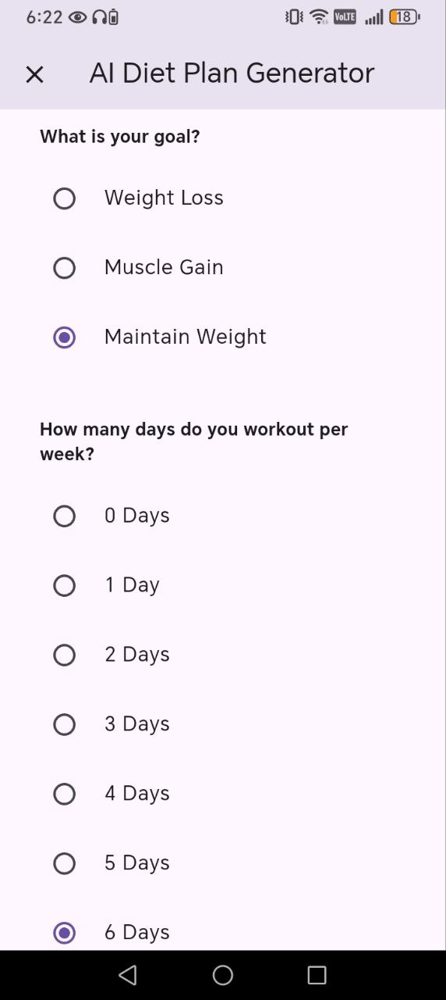
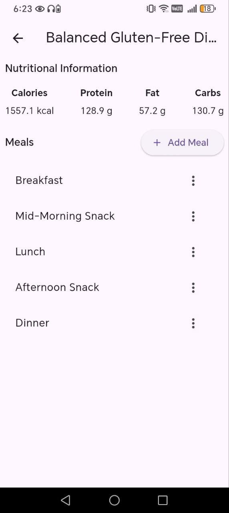

# Gaia nutrition plans

  

## Overview
Flutter/Dart app for creating and managing meal plans with local storage (SQFlite) and cloud sync (Supabase). Features Stripe payment, state management via GetX, Clean Architecture & MVVM patterns, fetching foods from USDA FDC API, AI-generated meal plans using Cohere API, and light/dark theme switching.

## Technologies Used
### Flutter / Dart
Flutter is an open source framework for building beautiful, natively compiled, multi-platform applications from a single codebase.
### SQFlite (Local Storage)
Sqflite is a popular package for implementing SQLite databases in Flutter. It provides a simple and efficient way to store and retrieve data from local storage, making it ideal for mobile
applications that require offline data access.
### Supabase (Cloud Storage)
Supabase is the Postgres development platform.Start your project with a Postgres database, Authentication, instant APIs, Edge Functions, Realtime subscriptions, Storage, and Vector embeddings.
### Stripe (Payment Gateway)
The Stripe Flutter SDK allows to build delightful payment experiences in native Android and iOS apps using Flutter. provide powerful and customizable UI screens and elements that can be used out-of-the-box to collect users' payment details.
### GetX (State Management)
GetX is an extra-light and powerful solution for Flutter. It combines high-performance state management, intelligent dependency injection, and route management quickly and practically.
Get has two different state managers: the simple state manager (we'll call it GetBuilder) and the reactive state manager (GetX/Obx).
### GetStorage (Local Settings Storage)
A fast, extra light and synchronous key-value in memory, which backs up data to disk at each operation. It is written entirely in Dart and easily integrates with Get framework of Flutter.
Supports Android, iOS, Web, Mac, Linux, and fuchsia and Windows. Can store String, int, double, Map and Lis
### Clean Architecture & MVVM
Clean Architecture is a software design pattern that separates the application into distinct layers (Presentation, Domain, and Data), ensuring high testability, maintainability, and scalability. Combined with MVVM (Model-View-ViewModel), it allows for clear separation of concerns, making UI and business logic independent.
### USDA FDC API (Food Data)
The USDA FoodData Central API provides comprehensive nutrition information about foods. It allows the application to fetch detailed nutrient data, food categories, and serving sizes to accurately generate meal plans and track user dietary intake.
### Cohere AI API (AI Meal Plan Generation)
Cohere AI API is a natural language processing API that can generate text-based outputs. In this project, it is used to generate automated meal plans based on user preferences, dietary restrictions, and nutritional goals.
### Light/Dark Theme Switching
Flutter provides built-in support for light and dark themes. This feature allows the application to dynamically switch between themes, enhancing user experience and accessibility based on user preference or system settings.
### infinite_scroll_pagination (Paginated Lists)
Unopinionated, extensible and highly customizable package to help you lazily load and display small chunks of items as the user scrolls down the screen – known as infinite scrolling pagination, endless scrolling pagination, auto-pagination, lazy loading pagination, progressive loading pagination, etc.

## Features
### Sign in / Sign up
Allows users to securely create a new account or log in to an existing one. Supports authentication via email/password and integrates with Supabase for secure user management and session handling.

**Screenshots:** 

  
    
  
### Payment / Subscription Activation
Enables users to securely pay for and activate their subscription within the app. Integrates with **Stripe** to provide a seamless payment experience, supporting multiple payment methods. The feature ensures secure handling of payment data and updates the user’s subscription status instantly upon successful payment.

**Screenshots:** 

  
  
  

  

**Payment / Subscription Activation Flow**
The app provides a secure and seamless payment process for activating user subscriptions. The flow is as follows:

1. **Initiate Payment Intent**  
   The user selects the desired product. The app calls a Supabase Edge Function to create a payment intent, securely storing the secret key. The function returns the necessary payment details to the app.
2. **Confirm Payment**  
   After receiving the payment details, the user confirms the transaction within the app.
3. **Stripe Webhook Notification**  
   Stripe notifies the system via a webhook once the payment is successfully completed.
4. **Activate Subscription**  
   The webhook-invoked function updates the user's subscription status in the database, activating the subscription immediately.

  

### Food Data Retrieval & Local Storage
The app fetches detailed food information from the USDA FoodData Central (FDC) API via a Supabase Edge Function. This ensures the API key is securely stored on the server and never exposed in the client app. The retrieved food data is then saved locally using SQFlite, allowing users to access nutritional information offline and enabling fast, responsive meal plan generation.  

**Flow:**  
1. The app calls a Supabase Edge Function to request food items and their nutritional information from the USDA FDC API.  
2. The Edge Function securely uses the API key to fetch the data and returns the results to the app.  
3. The app parses the returned data and saves it into the local SQLite database using SQFlite.  
4. The locally stored data is then used for meal planning, search, and other app features without requiring repeated network calls.

**Screenshots:**   

  
  

### Meal Plan Creation
The app allows users to easily create and customize their own dietary meal plans.

#### Steps to Create a New Meal Plan:
1. Navigate to the **Meal Plans** page.  
2. Tap the **Add** button.  
3. Fill in the required fields (plan name, description, etc.).  
4. Save the plan.  

**Screenshots:** 

  
  
  

### Adding a New Meal to a Plan
Once a plan is created, users can add meals to it with flexible customization.

#### Steps to Add a Meal:
1. Open the **Meal Plan Details** page.  
2. Tap **Add New Meal**.  
3. Fill in the meal-specific fields (e.g., name, type).  
4. Add ingredients to the meal via the **Ingredient Selection** page.  
5. Enter the weight/amount for each ingredient.  
6. Save the meal and add it to the plan.  

**Screenshots:** 

  
  
  
  
  

### Create Meal Plans with AI
When a user requests to generate a meal plan, the process runs through a **Supabase Function** that:

1. First checks if the user has an **active subscription** to the service.  
2. If the subscription is valid, the function securely uses the **AI model key** on the server side.  
3. The AI generates the full meal plan, and the result is returned to the user.  

**Why this design?**
- The **AI model key** is protected and never exposed to the client.  
- **Abuse prevention**, since only authorized users can trigger the generation.  
- The feature is **exclusive to paying subscribers**.  
  
**Steps:**  
1. Click the “Add AI-generated Plan” button.  
2. Select the options that form the prompt.  
3. Click “Create.”  
4. Wait for the AI to finish generating the plan.  
5. The plan will be automatically saved.  

**Screenshots:**  

  
  
  

### Light / Dark Theme Switching  
The app supports both light and dark themes, allowing users to easily switch between them for a comfortable viewing experience in any environment.  

**Screenshots:** 

  
  

## App Structure

  

The application is organized using a **Feature-Based Clean Architecture** combined with **MVVM (Model-View-ViewModel)** pattern. This ensures **separation of concerns, maintainability, and testability**:

- **core/constants:**  
  Contains app-wide definitions such as borders, sizes, and spacing.
- **features:**  
  Each feature (e.g., Diet Plan, Meals, Foods, User, Index Page) follows **Clean Architecture layers** and MVVM principles:  
  1. **Data Layer (Model):** Handles data from local sources (SQLite / GetStorage) or external APIs (Cohere AI / Supabase).  
  2. **Domain Layer:** Defines entities, repository interfaces, and use cases. This layer contains the **business logic**.  
  3. **Presentation Layer (View + ViewModel):**  
     - **View:** Pages and Widgets responsible for UI.  
     - **ViewModel / Controller:** Handles the state, interacts with use cases from the domain layer, and updates the UI accordingly.  
- **services_providers:**  
  Manages **dependency injection**, connecting repositories, services, and use cases to the ViewModels.
- **set_up_files:**  
  Initializes app configuration and services on startup.
- **shared_widgets:**  
  Reusable widgets used across multiple features, like dialogs or nutrition info cards.
- **main.dart:**  
  Entry point of the application, launching the app and initializing dependencies.

This combination of **Clean Architecture** and **MVVM** provides a **clear separation between UI, business logic, and data**, making the app highly maintainable, testable, and scalable while allowing easy addition of new features.

## Supabase 
Supabase is an open-source platform providing backend-as-a-service (BaaS) tools built on a PostgreSQL database. It offers a managed Postgres database, user authentication, file storage, serverless edge functions, and real-time data capabilities, all designed to simplify web and mobile app development. Think of it as a set of "backend-as-a-service" components that developers can use to build applications without managing the underlying infrastructure. 
### Database
A single table, **profiles** [sql1](https://github.com/mustafaAbdAlRazzak/gaia_nutrition_plans/blob/main/sql_codes/profiles_table.sql), stores user profile information linked to Supabase Auth. It includes fields such as **first_name**, **second_name**, **birthday**, **weight**, **height**, **gender**, and **subscription_expiry**.
### Trigger
A trigger function **handle_new_user()** [sql2](https://github.com/mustafaAbdAlRazzak/gaia_nutrition_plans/blob/main/sql_codes/handle_new_user.sql) automatically creates a new profile in the profiles table whenever a user signs up. This ensures that every authenticated user has a corresponding profile in the database.
### Edge Functions
Edge Functions are server-side Typescript functions, distributed globally at the edge — close to your users. They can be used for listening to webhooks or integrating your Supabase project with third-parties.
- **get foods** : [ef1](https://github.com/mustafaAbdAlRazzak/gaia_nutrition_plans/blob/main/edge_functions/get_foods.ts)
- **delete account** : [ef2](https://github.com/mustafaAbdAlRazzak/gaia_nutrition_plans/blob/main/edge_functions/delete_account.ts)
- **create payment intent** : [ef3](https://github.com/mustafaAbdAlRazzak/gaia_nutrition_plans/blob/main/edge_functions/create_payment_intent.ts)
- **stripe webhook** : [ef4](https://github.com/mustafaAbdAlRazzak/gaia_nutrition_plans/blob/main/edge_functions/stripe_webhook.ts)
- **generate diet plan** : [ef5](https://github.com/mustafaAbdAlRazzak/gaia_nutrition_plans/blob/main/edge_functions/generate_diet_plan.ts)

## Contact / Author
**Name:** Mostafa Abdel Razzak     
**Email:** [mustafaabdalrazzak2002101@gmail.com](mailto:mustafaabdalrazzak2002101@gmail.com)

You can reach out for any questions, collaborations, or feedback regarding this project.
